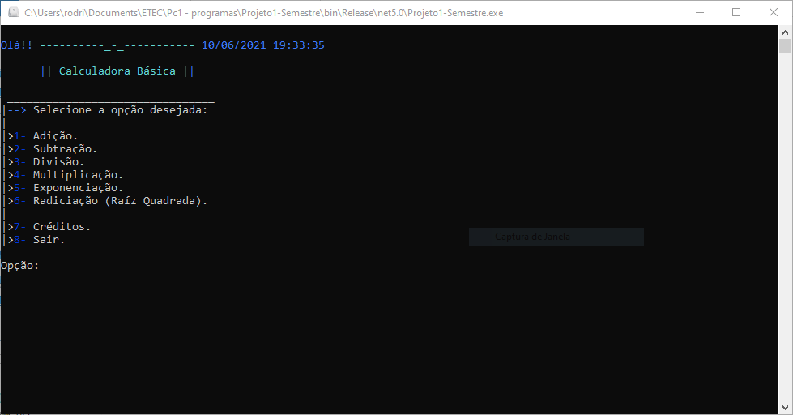
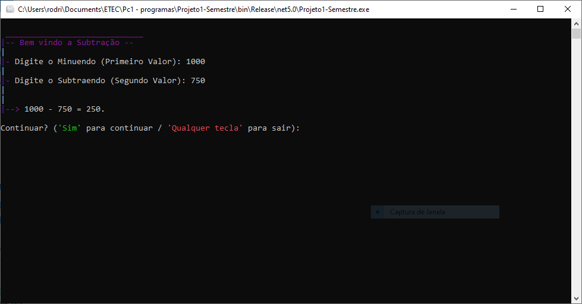
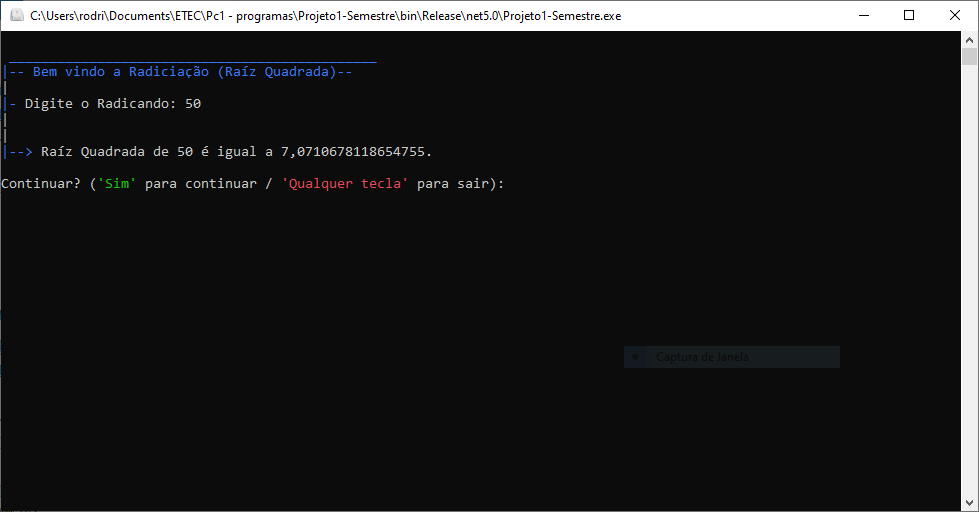

# _Calculadora Básica._

Projeto final do 1º Semestre do curso de 'Técnico em Informática'.


## _O que é?_

```
Trata-se de uma calculadora básica, proporcionando as quatro operações 
básicas como adição, subtração, multiplicação, divisão e também radiciação 
(sendo raíz quadrada) e exponenciação. 
Programa simples e fácil de se usar, sendo também objetivo, 
com uma interface agradável e intuitiva.
```


## _ScreenShots_







## _Download_

Baixe o arquivo abaixo, e descompacte na pasta desejada:

🗃 [Download Calculadora Básica .Zip](dist/CalculadoraBásica.zip.zip) 

Caso não seja Windows execute utilizando o comando:

```
dotnet Projeto1-Semestre.dll
```

Ou, se for no Windows, dê um duplo-clique no ícone do programa normalmente.


## _Agradecimentos_

--> [Etec Adolpho Berezin](http://eteab.com.br/cms/)

--> [Profº Ermogenes Palácio](https://github.com/ermogenes) & [Profº Diego Neri](https://github.com/diegoneri)

--> Turma 1 de 3 de Técnico em Informática do primeiro semestre de 2021.


---


Todos os direitos reservados. Diga não a pirataria, pirataria é CRIME.
